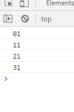
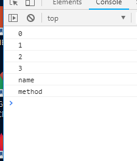
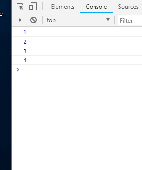

# JavaScript 数组遍历的一些坑

# 1. for in 循环遍历 

## 1.1. 坑1

- 不建议使用 `for in`  对数组进行遍历，原因在于:
  - 代码中的 **index** 变量将会是 "0"、"1"、"3" 等这样的**字符串**，而并不是数值类型。如果你使用字符串的 index 去参与某些运算（"2" + 1 == "21"）,运算结果可能会不符合预期

``` javascript
var arr = [1, 2, 3, 4]

for (var index in arr) {
  console.log(index + 1)
}
```



### 1.2. 坑2

- 不仅数组本身的元素将被遍历到，用户自己为数组添加的一些属性也会被遍历到，甚至数组原型链上的属性也可能被遍历到

``` javascript
var arr = [1, 2, 3, 4]
arr.name = "ben"
Array.prototype.method = function () {
  console.log("hello world")
}

for (var index in arr) {
  console.log(index)
}
```



### 1.3. 坑3

- 在某些情况下，上面代码会任意顺序去遍历数组元素，即显示顺序并不是按我们所想的那样

### 1.4. 总结

- 因此，`for in`  设计的目的是用来遍历**包含键值对的对象**，对数组不是那么友好

## 2. forEach 方法遍历

### 2.1. 坑

- 不能使用 `break`  语句来跳出循环
- 不能使用 `continue` 

``` javascript
var arr = [1, 2, 3, 4]
arr.forEach(function (value) {
  console.log(value)
})
```

## 3. for 循环

- 中规中矩，书写比较麻烦
- 需要跟踪计数器和退出条件

``` javascript
var arr = [1, 2, 3, 4]
for (var i =0; i < arr.length; i++) {
  console.log(arr[i])
}
```

## 4. es6 for of 循环遍历

- for of 循环用于循环访问任何可迭代的数据类型

``` javascript
const digits = [1, 2, 3, 4]
digits.name = "ben"
for (const digit of digits) {
  console.log(digit)
}
```

