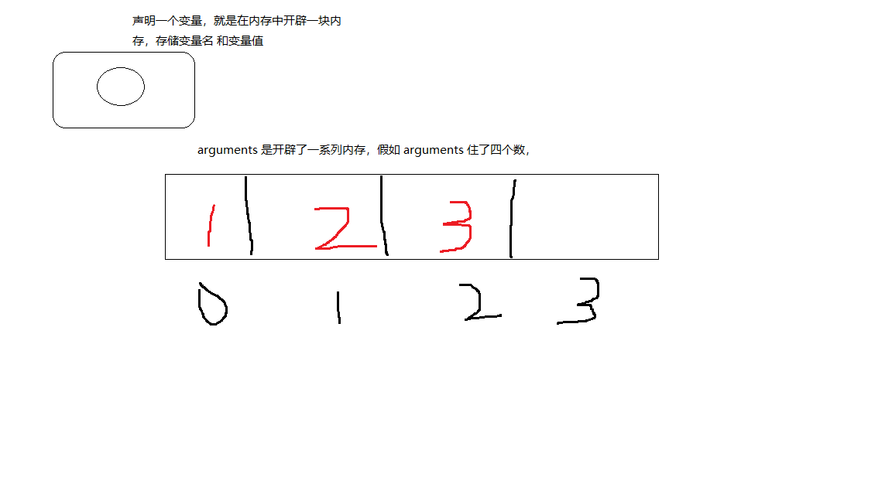
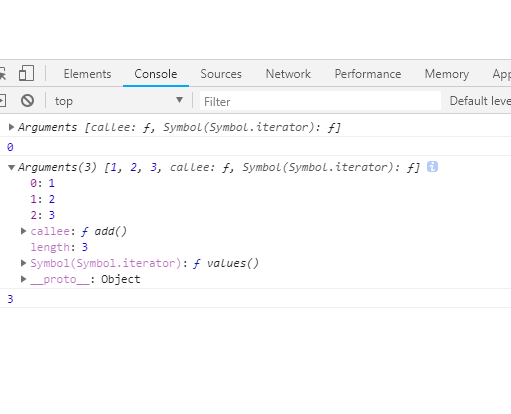
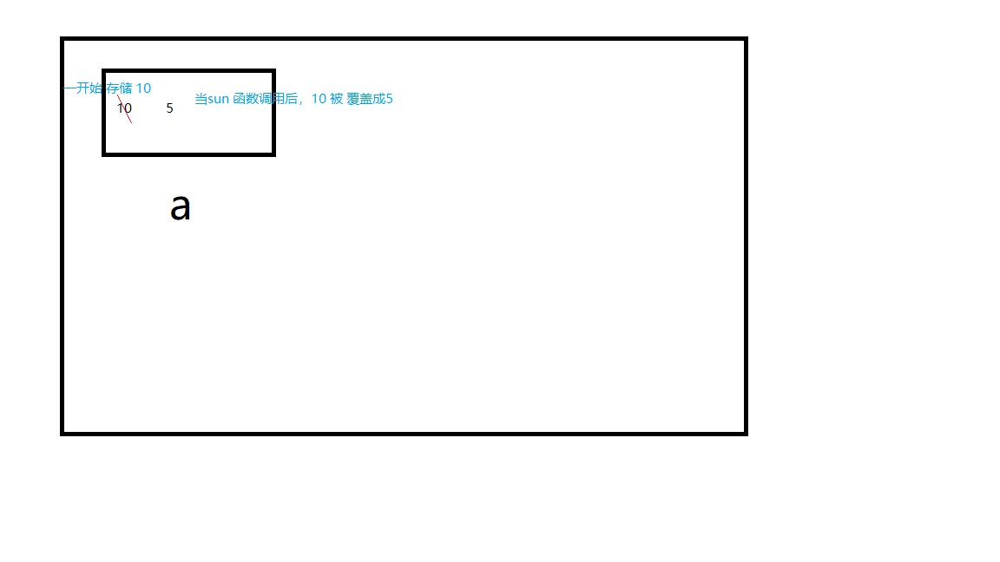
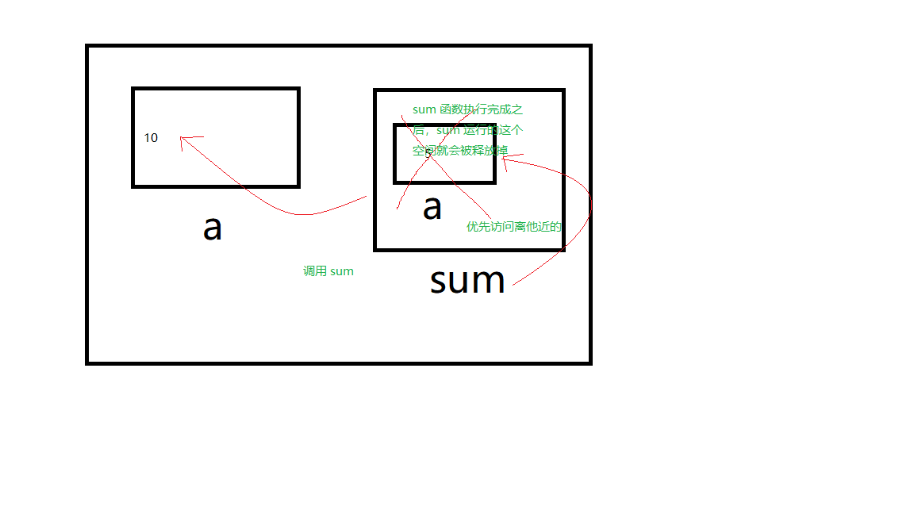
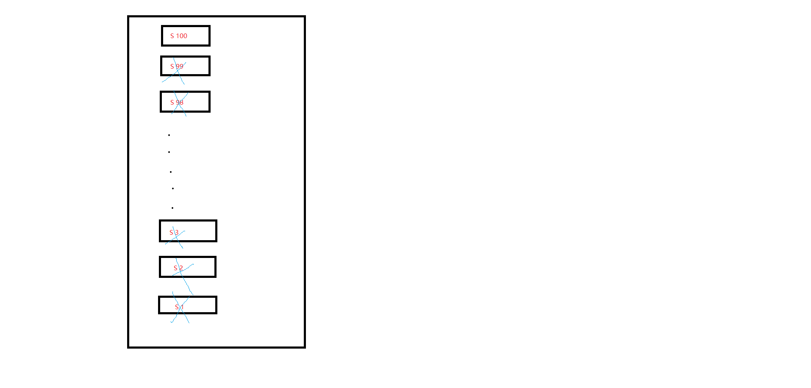

# 函数

## 1. 函数的概念

- 函数就是把完成特定功能的一段代码【抽象处理】，使之成为程序中的一个【独立实体】，起个名字（函数名）。可以在同一个程序或其他程序中多次重复使用（通过函数名调用）

## 2. 函数定义

### 2.1. 无参函数的声明

``` javascript
# 函数体内，外面怎么写 JS 代码，这里也如何去写 JS 代码
function 函数名() {
  函数体；
}

/* 
        执行程序
        程序被 CPU 所执行
     */

// 函数的声明 就相当于写说明书 写第 41 页说明书
function print() {
  for (var i = 0; i < 10; i++) {
    document.write('hello world<br />')
  }
}

// 函数被调用的时候 告诉 CPU 请翻到第 41 页进行执行
print()
```

### 2.2. 有参函数的声明

``` javascript
# 把函数中不确定的值当做形参（形式上的参数）进行声明
function 函数名(形参...) {
  函数体；
}

// 有参函数声明
function print(n) { // n 形参 n = 10
  for (var i =0; i < n; i++) {
    document.write("hello world!<br />")
  }
}

// 函数调用 实参给形参进行赋值 10实参 n形参
print(10)
```

### 2.3. 作用

- 1. 是程序变得更加简短而清晰
  2. 有利于程序的维护
  3. 可以提高程序开发的效率
  4. 提高了代码的重用性（复用性）

### 2.4. 形参和实参

- 函数的参数跟变量是一样使用
- 形参就是在函数定义时，函数名后面的参数，不能用 var 修饰
- 实参就是调用时，函数名后面的参数

## 3. 函数分类

### 3.1. 内置函数（系统函数、官方函数）

- alert()、parseInt()、document.write()等

### 3.2. 自定义的函数

- 用户更具体实际需求，自己封装一个函数
- 封装函数的时候。函数名 = 标识符。 必须见名思音。当前函数的函数名必须体现出函数功能

## 4. arguments 对象

- 在**每一个函数内**，都有一个**内置的数组**，是一个变量，叫做 arguments 。
- arguments 可以存储当前函数传入的所有参数，而且，是**通过传参的顺序，进行排列的**

``` javascript
# 需求：计算所有传入参数的和。具体传入多少参数不确定

function add() {
  console.log(arguments) //[object Arguments]
  
  # arguments.length 输出传入参数的个数 
  console.log(arguments.length)
  
  # 访问 arguments 的里面的数据，需要通过对应的房间号/下标进行访问
  console.log(arguments[0]) // 1
  
  # 下标可以配合我们循环去使用
  var sum = 0
  for (var i = 0; i < arguments.length; i++) {
    sum += arguments[i]
  }
  console.log(sum) // 6
}

add()
add(1, 2, 3)
```





## 5. 函数的返回值

``` javascript
funcution add(num1, num2) {
  console.log(num1 + num2)
  return num1 + num2
  alert(2) //这些代码执行不到
}

# 希望能够在函数外部获取到，函数调用的结果

add(1, 2)

# 如果要 在外部 获取 函数内 运行的结果，需要通过 return 语句后面所跟表达式的值 来实现返回值

var result = add(4, 5)
console.log(result) // undefined

# 【注】函数执行到 return 语句以后，就执行结束，跟在 return 后面的语句，执行不到

# 表达式
1. 表达式值
2. 表达式的功能
# 函数 分析函数
1. 函数值（return 后面表达式的值）
2. 函数功能（函数名）
```

## 6. 作用域

- 就是起作用的返回，或者说有效范围，**每一个函数的声明**都会形成一个作用域

``` javascript
var a = 10
function sum() {
  a = 5
}
console.log(a) // 10
sum()
console.log(a) // 5
```

在内存存储过程



``` javascript
var a = 10
function sum() {
  var a = 5
  console.log(a) // 5
}
console.log(a) // 10
sum()
console.log(a) // 10
```



``` javascript
# 证明在函数里面的变量，在函数调用完成之后，运行空间会销毁
function sum() {
  var a = 5
  alert(a) // 5
}
sum()
alert(a) // undefined
```

### 6.1. 总结

#### 6.1.1. 全局作用域

- 全局作用域声明的变量，叫 全局变量

#### 6.1.2. 局部作用域（函数）

- 局部作用域声明的变量，叫 局部变量
- 局部变量的生命周期和生效的范围，都是声明该变量的函数区域。当函数调用完以后，就直接销毁。

#### 6.1.3. 

- 如果全局作用域和局部作用域变量重名，我们采取就近原则，当前访问这个变量离哪个作用域近，就是哪个作用域。

## 7. 函数实例

### 7.1. 闰年

``` javascript
/* 
        判断一个年份是不是闰年
        分析：
            参数：年份
            返回值：是否是闰年
    */

function leapYear(year) {
  if (year % 400 === 0 || year % 4 === 0 && year % 100 != 0) {
    return true
  } else {
    return false
  }
}

alert(leapYear(2018))
```

### 7.2. 素数

``` javascript
/* 
        判断一个数是否是素数
        素数：只能被 1 和 它本身整除

        参数：一个数
        返回值：是否是素数  布尔值
    */

function primeNumber(num) {
  var isYes = false // 是否是素数

  for (var i = 2; i < num; i++) {
    if (num % i === 0) {
      isYes = true // 只要有一次成功
      break  
    } 

  }  

  return !isYes
}

alert(primeNumber(6))
```

## 8. 递归

【注】- 面试官问你递归相关的知识，面试官水平还不错

【注】- 工作中，一般情况下禁止你使用递归

 ### 8.1. 递归概念

- 函数可以自己调用自己，称为递归调用
- 我们可以写出递归，但是我们并不知道它是如何得出结果。

### 8.2. 函数的递归调用

#### 8.2.1. 方法

- 1. 首先去找**临界值**，即无需计算，获得的值
  2. 找这一次和上一次的关系
  3. 假如当前函数已经可以使用了，调用自身计算上一次的运行结果，再写出这次的运行结果

#### 8.2.2. 特点

- 1. 必须有参数
  2. 必须有 return

``` javascript
# 递归会在短时间内，使内存剧增。原因：只有计算出最后面一个临界值，我们前面所调用的这些函数才能逐一的释放
# 如果传入的值无穷大，那么计数机就会在一瞬间占用大量的内存，最后导致整个程序的崩溃
function sum(n) {
  if (n === 1) {
    return 1
  }
  return sum(n - 1) + n     
}

console.log(sum(100))
```



#### 8.2.3. 练习

``` javascript
/* 
	通过递归，打印 n 个 hello world
	*/
function print(n) {
  if (n === 0) {
    return 
  }
  document.write('hello world <br />')
  return print(n - 1)
}

print(10)
```

## 9. 斐波那契数列

- 【实例】

兔子繁殖问题，设有一对新生兔子，从**第四个月**开始他们**每个月月初**都生一对兔子。

新生的兔子从第四个月月初开始又每个月生一对兔子

按此规律，并假定兔子没有死亡，n （n <= 20）个月月末共有多少对兔子？

| 月份   | 一月兔  | 二月兔  | 三月兔  | 成熟兔  | 对数   |
| ---- | ---- | ---- | ---- | ---- | ---- |
| 1    | 1    | 0    | 0    | 0    | 1    |
| 2    | 0    | 1    | 0    | 0    | 1    |
| 3    | 0    | 0    | 1    | 0    | 1    |
| 4    | 1    | 0    | 0    | 1    | 2    |
| 5    | 1    | 1    | 0    | 1    | 3    |
| 6    | 1    | 1    | 1    | 1    | 4    |
| 7    | 2    | 1    | 1    | 2    | 6    |
| 8    | 3    | 2    | 1    | 3    | 9    |
| 9    | 4    | 3    | 2    | 4    | 13   |
| 10   | 6    | 4    | 3    | 6    | 19   |

发现：

n >=  4

sum(n) = sum(n-3) + sum(n-1)

``` javascript
function rabbit(month) {
  if (month < 4) return 1
  return rabbit(month-1) + rabbit(month-3)
}

console.log(rabbit(10))
```

## 10. 事件驱动函数

### 10.1. 什么是事件驱动函数

- 在和页面交互的过程中所调用的函数，该函数被称之为事件驱动函数

### 10.2. 什么是事件

- 和页面交互的行为称之为事件。