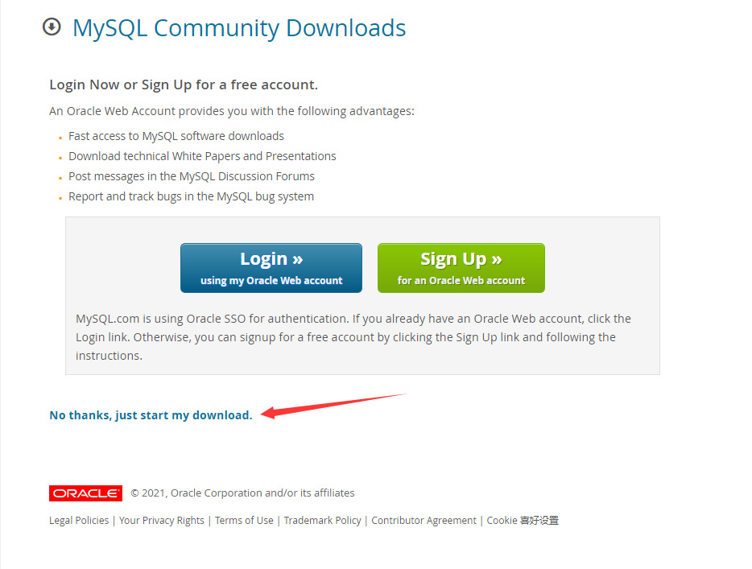

# MySQL

## 安装

下载地址：https://dev.mysql.com/downloads/mysql/

账号：root            密码：admin

### 步骤

1. 下载

   

2. 解压到相应目录，配置MySQL的配置文件`my.ini`

   ```ini
   [client]
   # 设置mysql客户端默认字符集
   default-character-set=utf8
    
   [mysqld]
   # 设置3306端口
   port = 3306
   # 设置mysql的安装目录
   basedir=E:\\software\mysql\mysql-8.0.22-winx64\mysql-8.0.22-winx64\
   # 设置 mysql数据库的数据的存放目录，MySQL 8+ 不需要以下配置，系统自己生成即可，否则有可能报错
   datadir=E:\\software\mysql\mysql-8.0.22-winx64\mysql-8.0.22-winx64\data
   # 允许最大连接数
   max_connections=20
   # 服务端使用的字符集默认为8比特编码的latin1字符集
   character-set-server=utf8
   # 创建新表时将使用的默认存储引擎
   default-storage-engine=INNODB
   ```

3. 以管理员身份打开cmd命令行工具

   > 1. 切换目录
   >
   > 2. 初始化数据库，执行输出root用户的初始化默认密码
   >
   >    ./mysqld --initialize --console
   >
   > 3. 安装命令
   >
   >    ./mysqld install
   >
   > 4. 启动
   >
   >    net start mysql
   >
   > 5. 修改密码
   >
   >    ALTER USER 'root'@'localhost' IDENTIFIED BY '新密码';
   >
   >    exit

4. 启动mysql

   > ./mysql -u root -p

### 填坑

1. mysql官网下载太慢解决办法

   > 复制下载地址到迅雷

2. mysqld: [ERROR] Found option without preceding group in config file xxx

   > my.ini文件格式，需要保存为ANSI格式文件

3. The service already exists! The current server installed xxx

   > 之前安装过MySQL，没有卸载干净，以管理员身份打开cmd命令行，输入：
   >
   > sc query mysql
   >
   > sc delete mysql
   
4. Navicat连接MySQL Server8.0版本时出现Client does not support authentication protocol requested by server；

## 忘记密码

### 方案一：执行初始化文件

### 方案二：使用登录时跳过验证的方式重置root密码

```shell
# 进入mysql的安装路径
$ cd E:\software\mysql\mysql-8.0.22-winx64\mysql-8.0.22-winx64\bin>
# 关闭mysql服务
$ net stop mysql
# 使用`--skip-grant-tables`配置项，跳过权限验证方式
$ ./mysqld --console --skip-grant-tables --shared-memory

# 窗口先不要关闭

# 新打开一个终端

# 使用免密的方式登录数据库，直接运行mysql
$ ./mysql
# 刷新执行指令`FLUSH PRIVILEGES;`，刷新权限
$ FLUSH PRIVILEGES;
# 设置密码
$ $ TABLE USER 'root'@'localhost' IDENTIFIED BY 'admin';
$ quit
```

## 设置密码

``` shell
$ TABLE USER 'root'@'localhost' IDENTIFIED BY 'xxxx密码';
```

## 使用

```shell
# 启动mysql服务
$ net start mysql
# 进入msyql
$ mysql -u root -p
# 退出msyql
$ quit
# 关闭mysql服务
$ net stop mysql
```

# MySQL

## 查询数据（Select）

一个基本select语句分解成三个部分：查找什么数据（select）、从哪里查找（from）、查找的条件是什么（where）

```mysql
select<目标列表达式列表>
[into 新表名]
from 表名或视图名
[where<条件>]
[group by<分组表达式>]
[order by<排序表达式>[ASC|DESC]]
```

### 查询指定的列

- 查询表中所有列

  > select * from tb_name;

- 查询表中指定的列

  > select tb_name.<字符型字段>,<字符型字段>... from tb_name

- 指定查询结果中的列标题

## 连接查询

### 定义

若一个查询同时涉及两个或两个以上的表，则称之为连接查询，连接查询可分为内连接、外连接和交叉连接

- 内连接（inner join on）

  内连接使用比较运算符对两个表中的数据进行比较，并列出与连接条件匹配的数据行，组合成新的记录。结果只保留满足条件的记录

  > select a列1,a列2,...a列n,b列1,b列2,...b列n from a inner join b on 条件;

- 外连接

  外连接的返回结果中不仅包含符合连接条件的行，还会包括左表、右表或两个表中的所有数据行，这两种情况分别称为左连接、右连接

  - 左连接（left join on）

    左表保持不动，右表在右侧滑动，用右表匹配左表。结果保留左表的所有行，右表中不匹配的行默认填充为空值NULL

    > select a列1,a列2,...a列n,b列1,b列2,...b列n from a left join b on 条件;

  - 右连接（right join on）

    同左连接相反

- 交叉连接

  交叉连接的返回结果是第一个表中符合查询条件的数据行乘以第二个表中符合查询条件的数据行数，即两个表中所有数据的组合

## 联合查询

union与union all的区别：union会把多个查询语句的结果合并后去重，union all会保留所有的查询结果

> select c_Name from members where c_adress='重庆' union select c_Name from members where c_address='浙江杭州'

