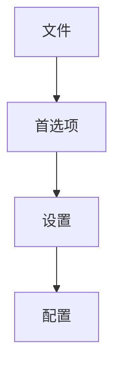

# 小程序开发技巧

#### 使用less
vscode有一个easy less插件：
1. vscode安装easy less
2. vscode中找到配置文件`settings.json`

``` js
"less.compile": {
    "compress": true, // 是否删除多余空白字符
    "sourceMap": false, // 是否创建文件目录树，true的话会自动生成一个 .css.map 文件
    "out": true, // 是否输出css文件，false为不输出
    "outExt": ".css", // 输出文件的后缀,默认为.css 或 .wxss
}
```
3. 创建一个less文件，并在文件头部添加编译注释`out: ./index.wxss, compress: true, sourceMap: false`
4. `ctrl + s`保存后自动编译
